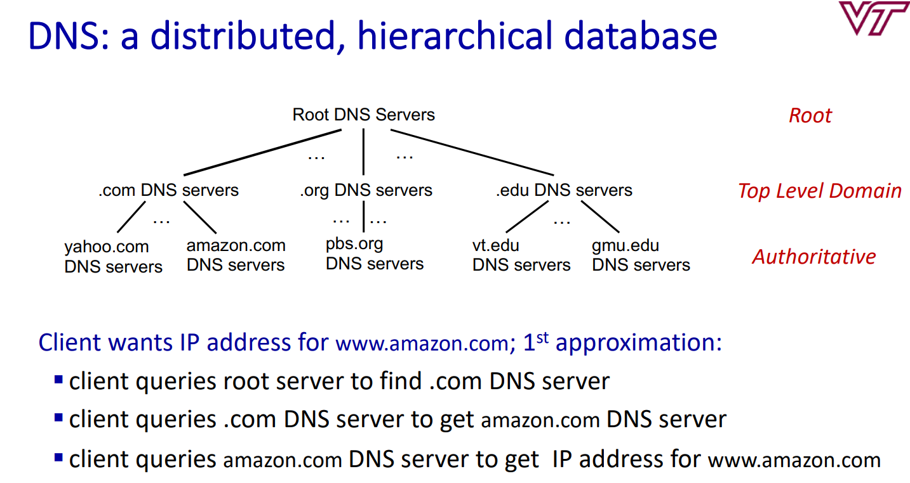

A distributed, hierarchical database

### Services:
- hostname to IP address translation
- host aliasing
- mail server aliasing
- load distribution

### Types of Servers
- Root Name Servers
	- contact-of-last-resort by other servers that cannot resolve a name
- Top Level Domain Servers
	- responsible for .com, .org, .net, .edu, .aero, .jobs, .museums, and all top-level country domains (.cn, .uk, .fr, .ca, .jp)
- Authoritative DNS Servers
	- organization's own DNS server, providing authoritative hostname to IP mappings for organization's named hosts
- Local DNS Servers
	- Does not strictly belong to the hierarchy
	- Each ISP (residential ISP, company, university) has one
	- When host makes a DNS query, the query is sent to its local DNS server 
		- has a cache of recent name-to-address translation pairs
		- acts as a proxy - forwards queries to the hierarchy

