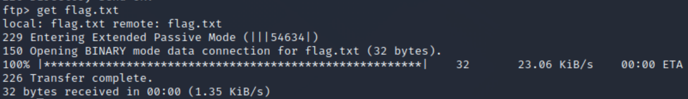

File Transfer Protocol - a standard communication protocol used for the transfer of computer files from a server to a client on a computer network

### ftp \<ip-address\> 
Logs you into the ftp server
Use `anonymous` as the username to login without a password, you will be prompted for one though.
Type `exit` to quit

![[Images/ftplogin.png|300]]

### get \<file\>
Copies a file from the ftp server to your computer

