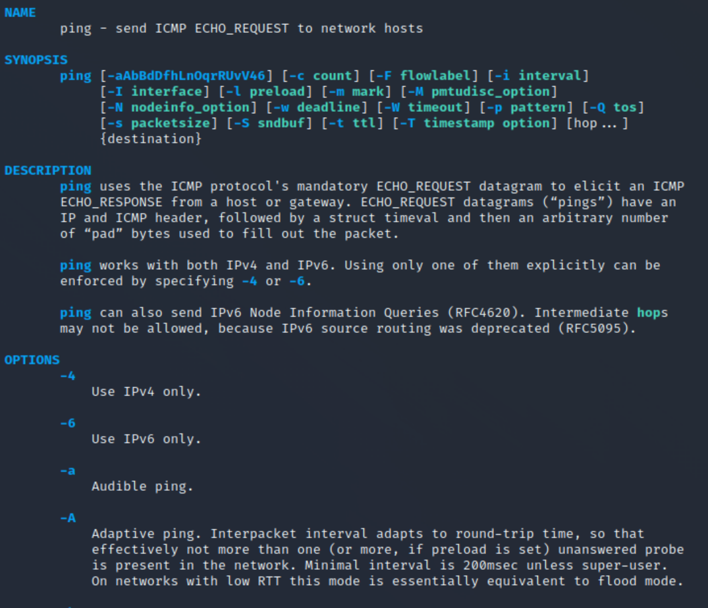

Linux terminal's version of Google.  

### man \<command\>
Gives an overview of what a command does, the different flags possible, and occassionally some examples.

Press `q` to exit out of the man page

![[../../Images/PingCommand.png|200]]

