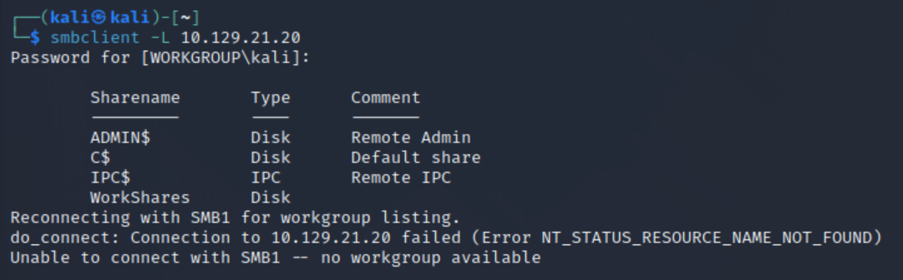
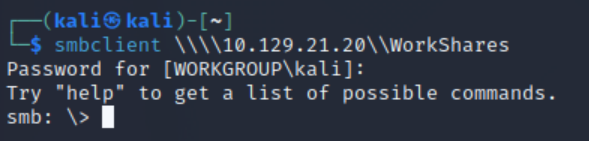
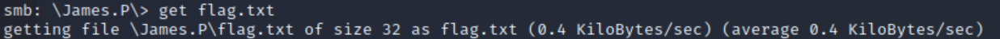

Server Message Block - a client-server communication protocol used for sharing access to files, printers, serial ports and other resources on a network

### smbclient -L \<ip-address\>
Lists different shares

### smbclient \\\\\\\\<ip-address\>\\\\\<share name\>
Logs you into a specific share
Type `exit` to quit

### get \<file\>
Copies a file from the share to your computer

