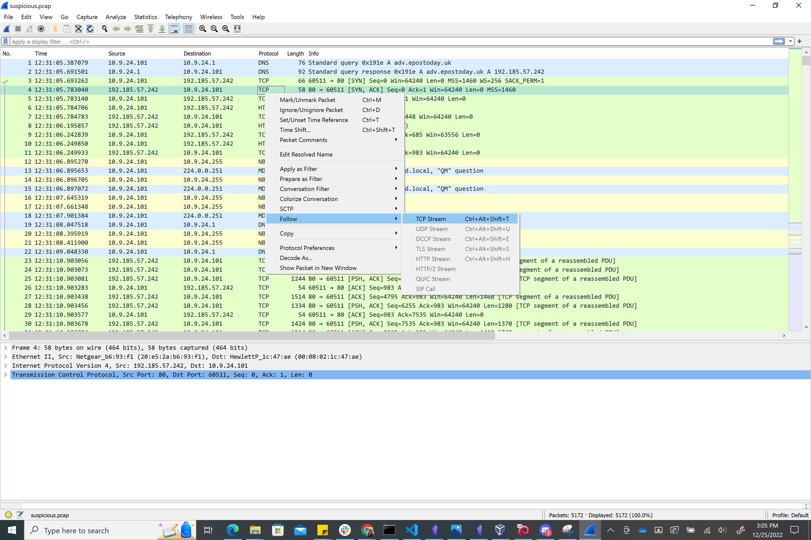

[TCP](../Lessons/TCP%20and%20UDP.md) sets up a connection with another device then sends packets of information (or data segments).  A stream is this communication of a group of packets.

1. Right Click > Follow > TCP Stream

2. A screen will pop up with information of the stitched together stream.  You can look through these one at a time.  Tools at the bottom of the screen let you modify what you're viewing.  If you decide what you are looking at doesn't contain helpful information, press the "Filter Out This Stream" button and it will bring you to the next stream.

