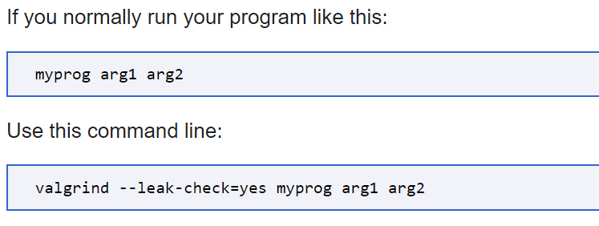

A tool that helps determine memory problems with programs
Additional Resources: http://www.valgrind.org/

## Running Valgrind
`valgrind <command to run program>`

### Options
`--leak-check=full`  
Display of details related to each leak that was detected

`--show-leak-kinds=all`  
Possible kinds of leaks include possible, indirect, definite, and reachable

`--track-origins=yes`  
Track the origins of unitinitalized values that have been used

`-v`
Be verbose

`--log-file=<filename>`
Write valgrind output to specified file instead of stdout

